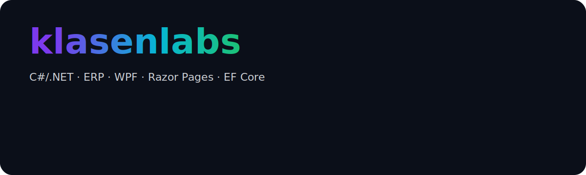

  

<h1 align="center">Hi, ich bin klasenlabs 👋</h1>

<em>C#/.NET · ERP · WPF · Razor Pages · EF Core</em>

  

  
  
  
  

  

  

<h2>Über mich</h2>

Ich entwickle <strong>klare, performante .NET-Anwendungen</strong> mit Schwerpunkt auf <strong>Datenzugriff</strong>, 
<strong>Design</strong>, <strong>Performance</strong> und <strong>sauberer Softwarearchitektur</strong>. 
Aktuell arbeite ich an Projekten in <strong>WPF/WinForms</strong> und <strong>ASP.NET Core Razor Pages</strong>.

<ul>
  <li>Clean Code, Testbarkeit, Logging/Tracing</li>
  <li>Git, Azure DevOps, SSMS, MySQL Workbench</li>
  <li>Standort: Saarland, DE</li>
</ul>

  <marquee behavior="scroll" direction="left" scrollamount="5" style="white-space:nowrap;">
    🛠️ Architektur · 🔒 Sicherheit · ⚡ Performance · 📊 Datenzugriff · 🎨 UI/UX
  </marquee>

<h2>Skills</h2>

  
  
  
  
  
  
  
  
  
  

  

<ul>
  <li><strong>Desktop:</strong> WPF, WinForms</li>
  <li><strong>Web:</strong> ASP.NET Core Razor Pages</li>
  <li><strong>Data:</strong> EF Core, SQL Server, MySQL</li>
  <li><strong>Tools:</strong> Git, Azure DevOps, SSMS, MySQL Workbench</li>
  <li><strong>Weitere:</strong> HTML/CSS, Grundkenntnisse in JavaScript</li>
</ul>

<h2>Projekte</h2>

Einige meiner Arbeiten:

<ul>
  <li>
    
    <strong> Sichere WPF-Chat-App</strong> — AES-GCM + RSA, WhatsApp-ähnliches UI, MVVM
  </li>
  <li>
    
    <strong> Razor Pages Statistik-Tool</strong> — MySQL, Charts, Grid-System, moderne UI
  </li>
  <li>
    
    <strong> WPF-Spiele</strong> — Snake, Solo-Billard (Highscore, Animationen, NAudio)
  </li>
  <li>
    
    <strong> User-Management in WPF</strong> — EF Core, MySQL, AWS Secrets Manager
  </li>
</ul>

  
📸 Screens / Demos (GIF)

   
  
  <!-- Obiges ist ein bekannter Open-Source-Generator; kann später optional durch eigene GIFs ersetzt werden -->

<h2>GitHub Stats</h2>

  
  

  

  

  

<!-- Hinweis: Alle oben verwendeten Icons/Bilder stammen aus Open-Source-Quellen:
     - Devicon (MIT): https://github.com/devicons/devicon
     - Simple Icons/Shields: https://simpleicons.org / https://shields.io
     - skillicons.dev (OSS): https://github.com/tandpfun/skill-icons
     - Stats/Trophies/Streaks (OSS Generatoren): vercel.app / vercel / demolab
-->
